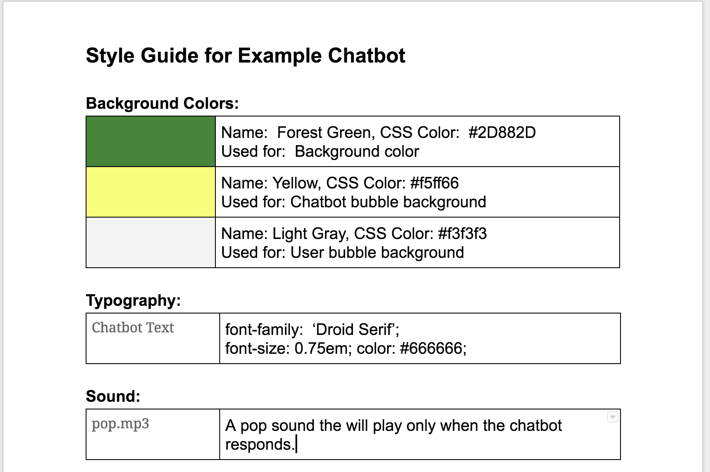

# 2.5 Style Guide



Create a simple document that outlines the style elements of your chatbot. You will want to determine the following elements, at a minimum, and document a description and visual samples of each when possible.

* **Background color or image** descriptions and visual samples
* **Text font-family and font-size** descriptions and samples \(Consider using [Google Fonts](https://fonts.google.com/) for a custom look\)
* **Text message "bubble" colors and styles** for the chatbot messages and the user messages \(you want them to look different\)
* **Sound effects** - Describe any sound and how it will be used.
* **Buttons** - This would include the send message button as well as any other buttons you may use in your chat interface.

**❏ Deliverable**  
A style guide document.




| ✓- Below Standard | ✓ At Standard | ✓+ Above Standard |
| :--- | :--- | :--- |



